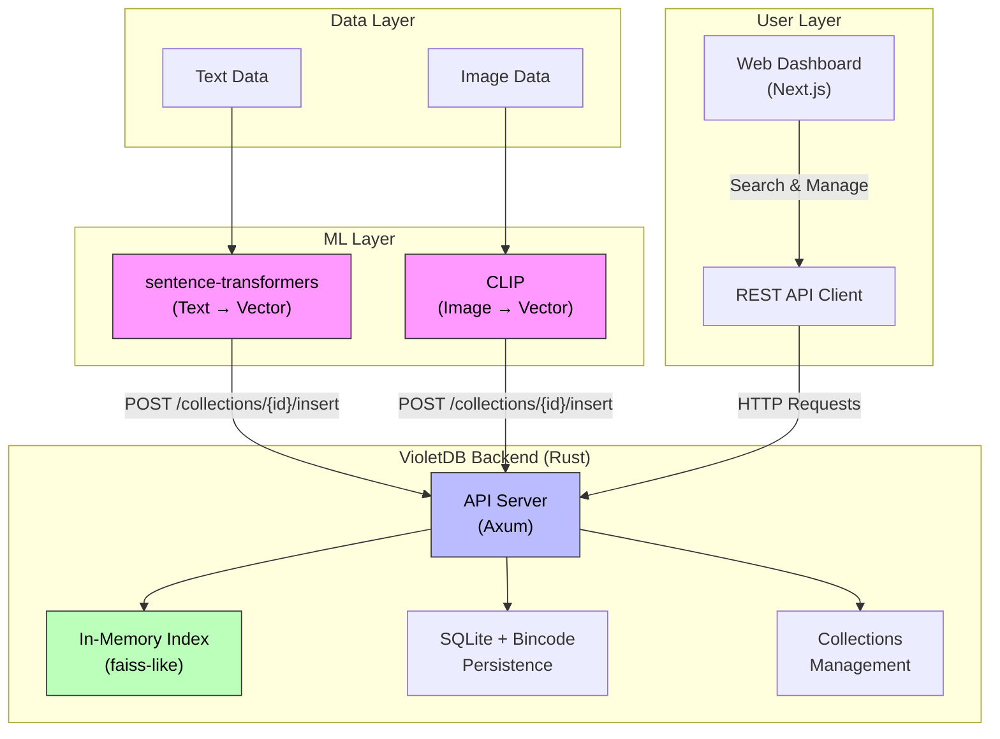

# VioletDB - Multimodal Vector Database

A high-performance vector database for multimodal embeddings (text + images). Built with Rust (backend), Python (ingestion), and Next.js (frontend).

## Tech Stack

| Component | Technology |
|-----------|------------|
| **Backend** | Rust, Axum, Bincode, SQLite |
| **Ingestion** | Python, uv, sentence-transformers, CLIP, FastAPI, Uvicorn |
| **Frontend** | Next.js 16, React 19, Tailwind CSS 4, Zustand, Radix UI |

## Quick Start

### Option 1: Docker (Recommended)

> **Important:** Before running Docker, you must download the required ML models first. See [ingest/README.md](ingest/README.md) for setup instructions.

```bash
# 1. Download models to ingest/models/ (see ingest/README.md)
# 2. (Optional) Add sample data to ingest/data/

# 3. Build and run all services
docker compose up --build

# Services will be available at:
# - Frontend: http://localhost:3000
# - Backend API: http://localhost:8000
# - Ingest API: http://localhost:8001
```

### Option 2: Local Development

> **Important:** Before running ingestion, you must download the required ML models and sample datasets. See [ingest/README.md](ingest/README.md) for setup instructions.

### 1. Ingestion

Generate embeddings from text or images and ingest into the database.

See [ingest/README.md](ingest/README.md) for setup and usage.

### 2. Backend Server

Start the VioletDB API server.

See [backend/README.md](backend/README.md) for setup and usage.

### 3. Frontend Dashboard

Web interface for managing collections and querying embeddings.

See [frontend/README.md](frontend/README.md) for setup and usage.

## Architecture



## Features

- **Multimodal Embeddings**: Text (sentence-transformers) + Images (CLIP)
- **Vector Similarity**: Cosine, Euclidean, Dot Product
- **In-Memory Index**: Fast querying with SQLite persistence
- **REST API**: Full CRUD operations on collections
- **Web Dashboard**: Visual interface for search and management
